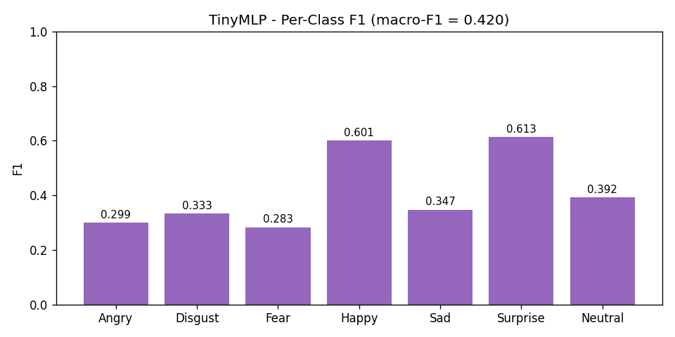
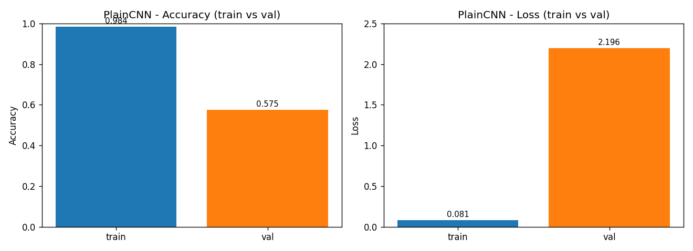
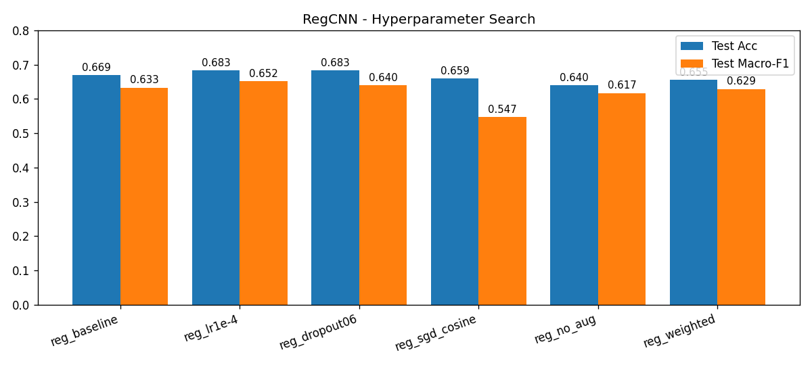
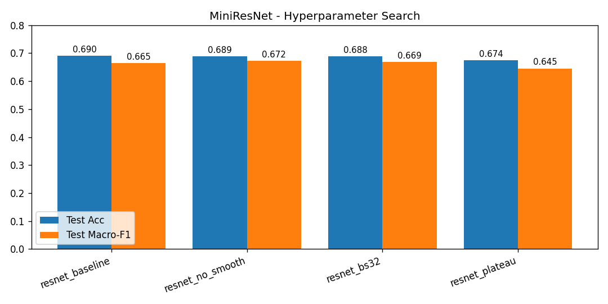
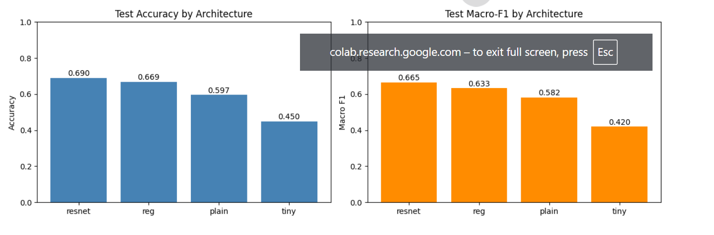

# FER2013 - Facial Expression Recognition

Kaggle challenge: [Challenges in Representation Learning: FER2013](https://www.kaggle.com/competitions/challenges-in-representation-learning-facial-expression-recognition-challenge/overview)

ემოციების კლასიფიკაცია 7 კატეგორიად, 48×48 ზომი
ს grayscale სახის გამოსახულებებიდან:

## wandb link -> 

https://wandb.ai/sgurj22-free-university-of-tbilisi-/fer2013/table?nw=nwusersgurj22

## არქიტექტურები

დიზაინის სტრატეგია მდგომარეობს იმაში, რომ დავიწყოთ უმარტივესი მოდელით და ეტაპობრივად გავართულოთ, რათა
დავინახოთ, თუ რას გვაძლევს თითოეული ცვლილება. ოთხივე არქიტექტურა სპეციალურადაა დალაგებული შემდეგი თანმიმდევრობით:
underfitting → overfitting → regularization → residual connections

---

### არქიტექტურა 1: TinyMLP - Underfitting - საბაზისო მოდელი

```
Flatten → Linear(2304, 128) → ReLU → Linear(128, 7)
Training პარამეტრები: ~297K
```

ამ არქიტექტურაში ორგანზომილებიანი გამოსახულება ჯერ იშლება ერთგანზომილებიან ვექტორად, რის შემდეგაც
ინფორმაცია გადაეცემა ორ linear შრეს, სადაც თითოეული პიქსელი სრულიად დამოუკიდებლად განიხილება. ქსელს არ გააჩნია spatial
inductive bias გამოსახულების სივრცითი სტრუქტურის აღსაქმელად, ხოლო 2304-განზომილებიანი ინფუთისთვის მხოლოდ 128 hidden
unit-ის არსებობა მოდელის capacity-ს მკვეთრად ზღუდავს. შედეგად, მოდელი განიცდის underfitting-ს, რაც ვლინდება
მაღალ train და val loss-ში და კიდევ იმაში, რომ მონაცემებს ვერ იმახსოვრებს. ამით ვხვდებით, რომ CNN-ის
გამოყენება აუცილებელია.



ყველა კლასზე F1 დაბალია (macro-F1 = 0.420); მხოლოდ Happy და Surprise აღწევს ~0.60-ს, რაც
ადასტურებს, რომ მოდელს ამოცანის სწავლის capacity არ ჰყოფნის.

---

### არქიტექტურა 2: PlainCNN - Overfitting-ის დემონსტრირება

```
Conv(1→32,3)→ReLU→MaxPool2 → Conv(32→64,3)→ReLU→MaxPool2 → Conv(64→128,3)→ReLU→MaxPool2
→ Flatten → Linear(4608, 256) → ReLU → Linear(256, 7)
Training პარამეტრები: ~1.2M
```

ამ არქიტექტურაში გამოყენებულ CNN-ებს აქვთ სწორი inductive bias გამოსახულებების მიმართ. 3 კონვოლუციური ბლოკი მკვეთრად
ზრდის მოდელის უნარს, ისწავლოს იერარქიული სივრცითი მახასიათებლები, თუმცა აქ განზრახ არ არის გამოყენებული BatchNorm,
Dropout ან data augmentation. შედეგად, მოდელი განიცდის მკვეთრ overfitting-ს, სადაც train loss თითქმის ნულამდე ეცემა,
ხოლო val loss იზრდება. ეს ექსპერიმენტი აჩვენებს, რომ დიდი capacity რეგულარიზაციის გარეშე მონაცემების დაზეპირებას იწვევს
და არა generalization-ს.



train accuracy აღწევს **98.4%**-ს, ხოლო val მხოლოდ **57.5%**-ს; train loss ეცემა **0.08**-მდე,
val loss კი იზრდება **2.20**-მდე — overfitting-ის სახელმძღვანელო მაგალითი.

---

### არქიტექტურა 3: RegCNN — რეგულირებული CNN

```
[Conv(3)→BN→ReLU→Conv(3)→BN→ReLU→MaxPool2] × 3   (არხები: 1→64→128→256)
→ Dropout(p) → Linear(9216, 512) → ReLU → Dropout(p) → Linear(512, 7)
Training პარამეტრები: ~4.7M
```

**რატომ ეს არქიტექტურა?**
ეს არქიტექტურა პირდაპირ აგვარებს PlainCNN-ის overfitting-ს სამი ძირითადი რეგულარიზაციის ტექნიკის დამატებით

- **BatchNorm ყოველი conv-ის შემდეგ**: ახდენს აქტივაციების ნორმალიზებას, ასტაბილურებს გრადიენტის დინებას და მოქმედებს
  როგორც მსუბუქი რეგულარიზატორი. ეს იძლევა სწავლის უფრო მაღალი კოეფიციენტის (learning rate) გამოყენების საშუალებას.
  ასევე თითო ბლოკში 1 კონვოლუციიდან 2 კონვოლუციაზე გადავდივართ, რაც capacity-ს ზრდის არასტაბილურობის გარეშე.
- **Dropout (0.5)**: აიძულებს ნეირონებს, ისწავლონ დუბლირებული, დამოუკიდებელი ნიშან-თვისებები და ხელს უშლის
  მათ ურთიერთადაპტაციას. გამოიყენება დიდ FC შრეებამდე, სადაც გადამეტებული overfitting-ის რისკი ყველაზე
  მაღალია.
- **მონაცემთა გამრავლება (Data augmentation)** (RandomHorizontalFlip, RandomRotation, RandomCrop, ColorJitter):
  პრაქტიკულად აორმაგებს ან ასამმაგებს სავარჯიშო დატის ზომას. მოდელი ყოველ ეპოქაში ხედავს თითოეული
  გამოსახულების ოდნავ განსხვავებულ ვერსიას, რაც ხელს უშლის დაზეპირებაში.

**რატომ ორმაგი კონვოლუცია თითო ბლოკში?** ერთი კონვოლუცია ბლოკში (როგორც PlainCNN-შია) ზედაპირულია. ორმაგი კონვოლუცია
საშუალებას იძლევა მივიღოთ უფრო მდიდარი feature map-ები ყოველი downsampling-ის
წინ - ეს არის VGG-დან ნასესხები პატერნი, რომელიც ემპირიულად კარგად მუშაობს მცირე ზომის გამოსახულებებზე.

**ჰიპერპარამეტრების ძებნა RegCNN-ისთვის** (ტესტინგ დატა, საუკეთესო val ჩექპოინტი):

| Run            | LR   | WD   | Dropout | Opt  | Sched   | Aug           | Val Acc | Test Acc | Test Macro-F1 |
|----------------|------|------|---------|------|---------|---------------|---------|----------|---------------|
| reg_baseline   | 1e-3 | 1e-4 | 0.5     | Adam | plateau | დიახ          | 65.8%   | 66.9%    | 0.633         |
| reg_lr1e-4     | 1e-4 | 1e-4 | 0.5     | Adam | plateau | დიახ          | 65.9%   | 68.3%    | 0.652         |
| reg_dropout06  | 1e-3 | 1e-4 | 0.6     | Adam | plateau | დიახ          | 65.9%   | 68.3%    | 0.640         |
| reg_sgd_cosine | 1e-2 | 5e-4 | 0.5     | SGD  | cosine  | დიახ          | 64.4%   | 65.9%    | 0.547         |
| reg_no_aug     | 1e-3 | 1e-4 | 0.5     | Adam | plateau | **არა**       | 63.1%   | 64.0%    | 0.617         |
| reg_weighted   | 1e-3 | 1e-4 | 0.5     | Adam | plateau | დიახ + წონები | 62.9%   | 65.5%    | 0.629         |



**ძირითადი მიგნებები:**

- **სწავლის კოეფიციენტი (Learning rate):** `lr=1e-4` და `1e-3` თითქმის იდენტურ შედეგს აჩვენებენ ვალიდაციაზე (~66%);
  SGD-ის გაშვება `lr=1e-2`-ზე ყველაზე სუსტი აღმოჩნდა და Disgust-ის F1 ნულამდე (0.00) დააგდო.
- **Dropout:** დროპაუტის გაზრდამ 0.5 → 0.6-მდე მნიშვნელოვანი სხვაობა არ მოგვცა, ასე რომ, 0.5 საკმარისია.
- **მონაცემთა გამრავლება (აბლაცია `reg_no_aug`):** აუგმენტაციის გარეშე მოდელი იზეპირებს - train ხტება **90.5%**
  -ზე, მაშინ როცა val სიზუსტე რჩება 63.1%-ზე (~27-პროცენტიანი სხვაობა, val_loss 1.68). აუგმენტაციით ეს სხვაობა ~4
  პროცენტამდე მცირდება (train 69.9% / val 65.8%). ეს არის ყველაზე ნათელი მტკიცებულება იმისა, რომ აუგმენტაცია რეალურ
  რეგულარიზაციას ახდენს.
- **კლასების აწონვა (`reg_weighted`):** inverse-frequency weighting-მა გაზარდა **Disgust-ის F1 მაჩვენებელი 0.476-დან
  0.533-მდე**, მაგრამ *ყველა სხვა კლასის* ხარჯზე, რის გამოც macro-F1 (0.617 → 0.595) და სატესტო სიზუსტე (66.9% → 65.5%)
  ოდნავ შემცირდა.

---

### არქიტექტურა 4: MiniResNet - Residual Connections + Global Average Pooling

```
Stem: Conv(1→64,3)→BN→ReLU→MaxPool2                # 48→24
Stage 1: StrideConv(64→128,3,s=2)→BN→ReLU + ResBlock(128)    # 24→12
Stage 2: StrideConv(128→256,3,s=2)→BN→ReLU + ResBlock(256)   # 12→6
Stage 3: StrideConv(256→512,3,s=2)→BN→ReLU + ResBlock(512)   #  6→3
Global Average Pooling → Dropout(p) → Linear(512, 7)
სატრენინგო პარამეტრები: ~5.3M

ResBlock: Conv(3)→BN→ReLU→Conv(3)→BN + skip → ReLU
```

**რატომ ეს არქიტექტურა?**

RegCNN-სგან განსხვავდება ორი რამით:

**Residual / skip connections:**
ტრადიციულ ქსელებში ინფორმაცია მიდის ეტაპობრივად: შრე 1 -> შრე 2 -> შრე 3. თუ ქსელი ძალიან
ღრმაა, უკუგავრცელებისას გრადიენტი უკან წამოსვლისას გზაში "კვდება" და პირველ
შრეებამდე ვეღარ აღწევს, რის გამოც ქსელი ვეღარ სწავლობს. MiniResNet-ში ვიყენებთ ე.წ. "შემოვლით გზას" ანუ skip
connection-ს. ყოველი ბლოკის შესავალს (x) პირდაპირ გადავსვამთ ხოლმე ბლოკის ბოლოში და ვუმატებთ x-ს : out = F(x) + x.
ამ დროს გრადიენტს უჩნდება პირდაპირი, შეუფერხებელი identity path. თუ კონვოლუციურ შრეებს გაუჭირდებათ სწავლა,
ინფორმაცია და გრადიენტი მაინც თავისუფლად იმოძრავებს ამ შემოვლითი გზით. მოდელს აღარ უწევს ნულიდან ახალი
ნიშან-თვისებების  
სწავლა, მხოლოდ იმას სწავლობს, რაც უკვე არსებულ x-ს აკლია.

**Global Average Pooling (GAP) Flatten+FC-ის ნაცვლად:**
წინა არქიტექტურაში (RegCNN), კონვოლუციების შემდეგ მიღებულ მატრიცებს ვშლიდით ერთ გრძელ ვექტორად (Flatten) და ვაერთებდით
დიდ Fully-Connected შრესთან. ამ შრეს მარტო 4.7 მილიონი პარამეტრი ჰქონდა, რაც ქსელის მთელი პარამეტრების 90% იყო, რაც
overfitting-ს იწვევდა. Global Average Pooling ამ 4.7 მილიონ პარამეტრს ანაცვლებს ნულოვანი პარამეტრით. იგი იღებს
თითოეულ მიღებულ მატრიცას და მასში არსებულ ყველა რიცხვს ამცირებს ერთ გასაშუალოებულ რიცხვამდე. 512 მატრიციდან პირდაპირ
ვიღებთ 512 რიცხვიან ვექტორს.

**რატომ უფრო დაბალი dropout (0.4)?** GAP თავისთავად უკვე მოქმედებს როგორც ძლიერი რეგულარიზატორი. GAP-ის ზემოდან 0.5
დროპაუტის გამოყენება იწვევს არასაკმარის მორგებას (underfitting). 0.4 უკეთესი ბალანსია.

**Label smoothing - 0.1:** 7 კლასის არსებობისას, მკაცრმა ლეიბლებმა (hard labels) შეიძლება
გამოიწვიოს ზედმეტად თავდაჯერებული პროგნოზები. ლეიბლების შერბილება ანაწილებს 0.1 ალბათობის მასას არასწორ კლასებზე, რაც,
აუმჯობესებს განზოგადებას. **ჩვენს ექსპერიმენტებში ამან არ უშველა პრობლემას** - იხილეთ აბლაცია ქვემოთ.

**ჰიპერპარამეტრების ძებნა MiniResNet-ისთვის** :

| Run              | LR   | Dropout | Sched   | Label Smooth | Batch | Val Acc | Test Acc  | Test Macro-F1 |
|------------------|------|---------|---------|--------------|-------|---------|-----------|---------------|
| resnet_baseline  | 1e-3 | 0.4     | cosine  | 0.1          | 64    | 67.7%   | **69.0%** | 0.665         |
| resnet_no_smooth | 1e-3 | 0.4     | cosine  | 0.0          | 64    | 67.8%   | 68.9%     | **0.672**     |
| resnet_bs32      | 5e-4 | 0.4     | cosine  | 0.0          | 32    | 67.4%   | 68.8%     | 0.669         |
| resnet_plateau   | 1e-3 | 0.4     | plateau | 0.1          | 64    | 68.0%   | 67.4%     | 0.645         |



**ძირითადი მიგნებები:**

- **ლეიბლების შერბილებამ არ იმუშავა:** `resnet_no_smooth`-მა (LS=0.0) *ყველაზე მაღალ* ტესტურ macro-F1-ს მიაღწია(
  0.672 vs 0.665), ხოლო სიზუსტით თითქმის თანაბარი იყო. შერბილების ჰიპოთეზა FER2013-ზე არ გამართლდა - რეგულარიზატორები,
  რომლებიც დიდ დატასეტზე მუშაობენ, მცირე და დისბალანსურ დატაზე შედეგს არ იძლეოდნენ.
- **Scheduler:** cosine და plateau ახლოს არიან val-ზე (68.0% plateau vs 67.7% cosine),
  მაგრამ cosine უკეთ განზოგადდება სატესტო დატასეტზე (69.0% vs 67.4%).
- **Batch size:** ზომის 32-მდე შემცირებამ უპირატესობა არ მოგვცა.

---

## wandb ექსპერიმენტები

| ჯგუფი              | არქიტექტურები            | მიზანი                                                   |
|--------------------|--------------------------|----------------------------------------------------------|
| `arch_comparison`  | tiny, plain, reg, resnet | გვერდიგვერდ შედარება ერთნაირი ბაზისური ჰიპერპარამეტრებით |
| `reg_hp_search`    | reg                      | ჰიპერპარამეტრების ძიება RegCNN-ისთვის                    |
| `resnet_hp_search` | resnet                   | ჰიპერპარამეტრების ძიება MiniResNet-ისთვის                |
| `reg_sweep`        | reg                      | WandB Automated Sweep                                    |
| `resnet_sweep`     | resnet                   | WandB Automated Sweep                                    |

**ლოგირდება ყოველ ეპოქაში:** `train_loss`, `train_acc`, `val_loss`, `val_acc`, `f1_macro`, `grad_norm`, `lr`,
`f1_{Angry}`, `f1_{Disgust}`, `f1_{Fear}`, `f1_{Happy}`, `f1_{Sad}`, `f1_{Surprise}`, `f1_{Neutral}`

**ლოგირდება ბოლოს:** `test_acc`, `test_f1`, confusion matrix, 32-ნიმუშიანი პროგნოზების ცხრილი,
მოდელის არტეფაქტი

---

## Sanity Checks

სრულ წვრთნამდე სამი შემოწმება ადასტურებს იმას, რომ იმპლემენტაცია სწორია.

### შემოწმება 1: Forward pass

შემთხვევითი ინიციალიზაციისას, მოდელი, რომელსაც არანაირი წინასწარი ცოდნა არ აქვს, თითოეულ 7 კლასს დაახლოებით თანაბარ
ალბათობას უნდა ანიჭებდეს. ეს გვაძლევს CrossEntropy დანაკარგს:

```
-log(1/7) = ln(7) ≈ 1.9459
```

თუ საწყისი დანაკარგი ამ მნიშვნელობისგან შორს არის (მაგალთად, 4.0 ან 0.3), ანუ რაღაც რიგზე ვერ არის წონების
ინიციალიზაციაში, მონაცემთა ნორმალიზაციაში ან მოდელის forward pass-ში.

### შემოწმება 2: overfitting ერთ batch-ზე (Forward + Backward)

ვატრენინგებ მოდელს ერთ ბეტჩზე 200 ბიჯის განმავლობაში. დანაკარგი უნდა მიუახლოვდეს 0-ს, ხოლო სიზუსტე — 1.0-ს.

ეს ადასტურებს, რომ:

- Forward pass აწარმოებს ვალიდურ აუთფუთს
- Backward pass სწორად ითვლის გრადიენტებს
- ოპტიმიზატორი სწორად აახლებს პარამეტრებს
- არქიტექტურას აქვს ტევადობა, რომ მინიმუმ 64 მაგალითი დაიმახსოვროს

თუ მოდელს არ შეუძლია overfitting ერთ ბეტჩზე, ეს bug-ია და არა რეგულარიზაციის პრობლემა.

### შემოწმება 3: გრადიენტის flow (Backward pass)

ერთი backward pass-ის შემდეგ, ყველა პარამეტრის ტენზორს უნდა ჰქონდეს ნულისაგან განსხვავებული გრადიენტი. ნულოვანი
გრადიენტები მიუთითებს შემდეგ პრობლემებზე:

- vanishing gradient (ზედმეტად ღრმა ქსელი, ცუდი ინიციალიზაცია)
- მკვდარი ReLU-ები (ყველა პრეაქტივაცია უარყოფითია, გრადიენტი არის 0)
- დაუკავშირებელი შრეები (არქიტექტურული ხარვეზი - გამოსავალი არ არის დამოკიდებული ამ შრეზე)

გენერირდება საშუალო აბსოლუტური გრადიენტი ყოველი შრისთვის. ეს შემოწმება განსაკუთრებით მნიშვნელოვანია იმის
დასადასტურებლად,
რომ MiniResNet-ში skip connection-ები სწორად არის მიერთებული.

---

## ძირითადი მიგნებები

### underfitting-ის დიაგნოსტიკა (TinyMLP)

- Train acc 65.3% / val acc 44.1% - val დაბალია და train-თან სხვაობა ~21 პუნქტია: მოდელი ვერ აღწევს
  მაღალ train accuracy-ს (capacity-ის ნაკლებობა) და ვერც განზოგადებას ახერხებს.
- Test acc 45.0%, macro-F1 0.420 - ეს არის მინიმალური ზღვარი .
- **პრობლემის გადაჭრა:** CNN, ტევადობის გაზრდა.

### overfitting-ის დიაგნოსტიკა (PlainCNN)

- ტრენინგის სიზუსტე აღწევს **98.4%**-ს, ხოლო val acc-ის აღწევს 57.5%–ზე - სხვაობა ~41 პროცენტია.
- ვალიდაციის დანაკარგი იზრდება **2.20**-მდე, ხოლო ტრენინგის დანაკარგი მცირდება **0.08**-მდე — ეს overfitting-ითვის
  დამახასიათებელი ქცევაა.
- **პრობლემის გადაჭრა:** BatchNorm, Dropout, data augmentation, weight decay, → გადასვლა
  RegCNN-ზე.

### კლასების დისბალანსი FER2013-ში

FER2013 - მკვეთრად დისბალანსია. Disgust-ს აქვს ~600 ნიმუში, Happy-ს კი — ~8000. ჩვეულებრივი Accuracy აქ
შეცდომაში შეგვიყვანს - მოდელი, რომელიც მხოლოდ Happy-ს გამოიცნობს, მიიღებს ~25%-იან სიზუსტეს (სვიპის ერთ-ერთი
გაშვება macro-F1 0.057-ით მხოლოდ Happy-ს პროგნოზირებაზე ჩამოიშალა). **Macro-F1** უკეთესი მეტრიკაა, რადგან ის
შვიდივე კლასს თანაბარ წონას ანიჭებს, სწორედ ამიტომ იწერება ლოგებში თითოეული კლასის F1 ყოველ ეპოქაში.

ყველა გაშვებაზე **Disgust** არის ყველაზე არასტაბილური კლასი (F1 მერყეობს 0.00–0.60 დიაპაზონში) და **Fear** არის
სტაბილურად ყველაზე სუსტი (~0.40–0.50, ხშირად ერევა Sad/Neutral კლასებში), მაშინ როცა **Happy** ყოველთვის ძლიერია (~
0.86). ჩვენ გამოვცადეთ **class-weighted loss** (`reg_weighted`): მან გაზარდა Disgust-ის F1 (0.476 →
0.533), მაგრამ შეამცირა ყველა სხვა კლასის მაჩვენებელი, რის გამოც macro-F1 და ზოგადი Accuracy დაეცა. დასკვნა: იმ ერთი
კლასის გაუმჯობესებამ იმდენად დააზიანა ყველა დანარჩენი კლასი, რომ მოდელის საერთო სატესტო სიზუსტე დაეცა.
შესაბამისად, წონების აფდეითი ამ დატასეტისთვის ავტომატურად მომგებიანი გადაწყვეტილება არ აღმოჩნდა.

### რატომ არის Global Average Pooling უკეთესი, ვიდრე Flatten+FC

RegCNN-ის FC შრეს (`256×6×6 → 512`) აქვს 4.7M პარამეტრი — ქსელის თითქმის მთელი რესურსი იხარჯება სივრცითი პოზიციების
დამახსოვრებაზე. GAP კი სივრცით ინფორმაციას აჯამებს მნიშვნელობის მიხედვით (თითოეული ნიშან-თვისების რუკის საშუალო
აქტივაცია) და ამისთვის იყენებს ნულოვან პარამეტრს. სწორედ ამიტომ ახდენს MiniResNet უკეთეს განზოგადებას, მიუხედავად
მსგავსი ჯამური პარამეტრების რაოდენობისა.

---

## შედეგების შეჯამება

საუკეთესო run თითოეული არქიტექტურისთვის:



| არქიტექტურა | Val Acc | Test Acc  | Test Macro-F1 | Params | ქცევა                    |
|-------------|---------|-----------|---------------|--------|--------------------------|
| TinyMLP     | 44.1%   | 45.0%     | 0.420         | 297K   | Underfitting             |
| PlainCNN    | 57.5%   | 59.7%     | 0.582         | 1.2M   | Overfitting, train 98.4% |
| RegCNN      | 65.9%   | 68.3%     | 0.652         | 4.7M   | Good fit                 |
| MiniResNet  | 67.7%   | **69.0%** | **0.672**     | 5.3M   | Best generalization      |

პროგრესი მონოტონურია ყველა მეტრიკაში: სივრცითი სტრუქტურის დამატება (CNN), შემდეგ რეგულარიზაცია (RegCNN), და ბოლოს
residual connections  + GAP (MiniResNet) — თითოეულ ნაბიჯზე ხდება გაუმჯობესება. საუკეთესო მოდელი აღწევს **69.0%
სატესტო accuracy-ს და 0.672 macro-F1-ს** — რაც კონკურენციაში შედის Kaggle-ის თავდაპირველ ლიდერბორდთან (~71%) და უახლოვდება
ადამიანის მიერ ამ 7-კლასიანი ამოცანის ამოცნობის დონეს (~65%).
